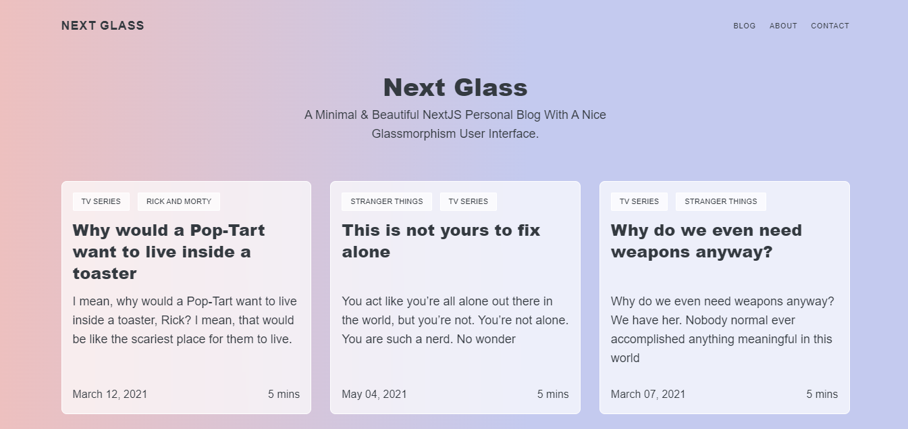

# Next Glass

A minimal and beautiful NextJS personal blog with a nice glassmorphism user interface. The contents are managed with Sanity.

[View Live Demo](https://next-glass-gamma.vercel.app/)



## Features

- Fully responsive
- Contact form with Formspree
- Edit Content with Sanity CMS
- Easy to deploy

## Local Install

```bash
# 1. Clone the repository
git clone https://github.com/shokes/Next-Glass

# 2. Navigate into repository
cd next-glass

# 3. Install the dependencies
npm install

# 4. Start the development server
npm run dev
```

## Built with

- NextJS for Static Site Generation
- Sanity CMS for content management
- TailwindCSS for styling

## Author

👤 **Oshoke Oyati**

- Website: https://oshoke.vercel.app/
